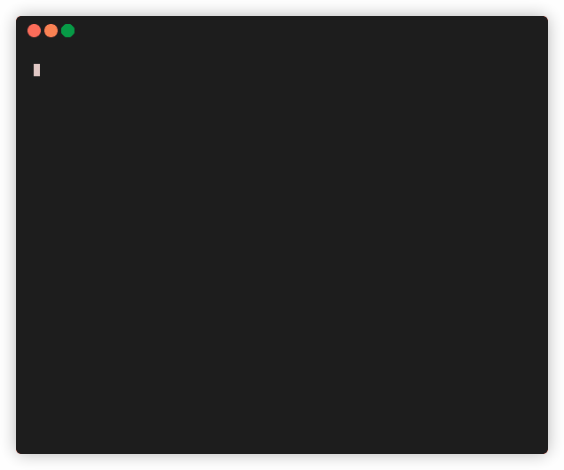

# Aufgabe 2

Diese Aufgabe trainiert das Problemlösen.

Deine Aufgabe ist es, eine Mini-Dateibrowser-Anwendung zu erstellen. Arbeite in `app.js`. Sieh dir die Referenzanimation unten für eine Anleitung an.

## Anforderungen

- Das Programm sollte mit `node app.js /my/path` gestartet werden.

- Wenn der Pfad nicht in den Programmargumenten enthalten ist, beende das Programm.

- Wenn der Pfad in den Programmargumenten kein gültiger Ordner ist, beende das Programm.

- Gib eine geordnete Liste der Inhalte im angegebenen Ordner aus; `/my/path`.

- Frage den Benutzer nach einer Eingabe, was als nächstes zu tun ist.

- Wenn der Benutzer eine Zahl eingibt, wechsle zu diesem Verzeichnis aus der Liste und gib eine geordnete Liste aus.

- Wenn der Benutzer etwas eingibt, das kein gültiger Ordner ist, beende das Programm.

## Hinweise

- `fs.readdirSync("/path/to/folder")`
- `fs.readdirSync("/path/to/file.pdf")` löst einen Fehler aus
- `fs.readdirSync("asdfghasdg")` löst einen Fehler aus
